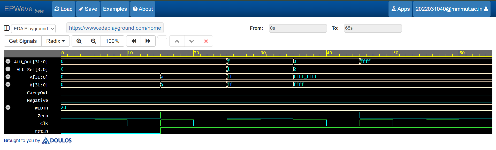

# 🚀 Parameterized Pipelined ALU (SystemVerilog)

**A parameterized 32-bit pipelined ALU designed for high-performance SoC integration, featuring status flags and synchronous logic.**

---

## 📌 Project Overview
This repository contains a silicon-grade implementation of an Arithmetic Logic Unit (ALU). Unlike basic combinational designs, this architecture is **synchronous and pipelined**, making it suitable for modern high-frequency processor cores and ASIC environments.

## 🛠 Key Engineering Features
* **SystemVerilog (IEEE 1800-2012):** Utilizes `always_comb` and `always_ff` blocks to ensure synthesis-safe RTL and prevent inferred latches.
* **1-Stage Pipeline:** Incorporates an output register stage to break the combinational path, significantly improving **Timing Closure** and increasing maximum operating frequency ($F_{max}$).
* **Fully Parameterized:** The `WIDTH` parameter allows for instant scaling (8, 16, 32, or 64-bit) to meet diverse SoC requirements.
* **Arithmetic Status Flags:** Hardware-level generation of `Zero`, `Negative`, and `CarryOut` flags, providing essential feedback for branch-logic and control units.

## 📊 Instruction Set Architecture (ISA)
| Opcode (ALU_Sel) | Operation | Type | Description |
| :--- | :--- | :--- | :--- |
| `4'b0000` | **ADD** | Arithmetic | Addition with Carry |
| `4'b0001` | **SUB** | Arithmetic | Subtraction |
| `4'b0010` | **AND** | Logical | Bitwise AND |
| `4'b0011` | **OR** | Logical | Bitwise OR |
| `4'b0100` | **XOR** | Logical | Bitwise Exclusive OR |
| `4'b0101` | **NOR** | Logical | Bitwise NOR |

## 🧪 Functional Verification
Verification was performed using a **Directed Testbench** in Icarus Verilog.

### Timing Analysis (Waveform)

**Design Analysis:**
* **Latency:** The design exhibits a **1-clock cycle latency**. 
* **Behavior:** Stimulus applied at the rising edge of $T_n$ is processed through the combinational logic and captured by the pipeline registers, appearing at the output on the rising edge of $T_{n+1}$.
* **Hardware Impact:** This registered output ensures that the "Setup Time" requirements of the next logic stage are easily met, even at high clock speeds.

## 📂 Repository Structure
* **/rtl**: `alu.sv` — The core logic (Design Under Test).
* **/tb**: `alu_tb.sv` — The SystemVerilog Testbench.
* **/sim**: Contains simulation waveforms and timing diagrams.

## 🚀 How to Run
1. Open [EDA Playground](https://www.edaplayground.com).
2. Upload `alu.sv` and `alu_tb.sv`.
3. Select **Icarus Verilog 0.10.0** as the simulator.
4. Check **Open EPWave after run** and click **Run**.
